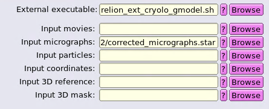
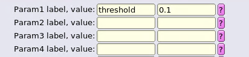
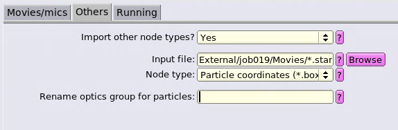

Quickstart Guide
----------------

## Steps

 * (Required) It is assumed that all imported movies or micrographs in the Relion project are in one folder and not in a complex EPU hierarchy.
 * Start any (GPU or CPU) version of Relion in a new terminal, the generated crYOLO submission script uses its own environment without interference.
 * Go to **External** entry at the bottom
 * As external executable enter **relion_ext_cryolo_gmodel.sh**
 * As input micrographs use a **Motioncorr** job result file like **corrected_micrographs.star**
 * At the **Running** tab **disable cluster submission**. Otherwise Relion will use the Relion template instead of the generated crYOLO script.
 * Press **Run** and watch the logfiles until its finished. The wrapper script sends the crYOLO to the cluster (or runs it locally).

The script currently supports the additional crYOLO parameter threshold. If you need to change this you can add in the **Params** tab
otherwise the **default value** of **0.3** is used:

When the script is done look at the Relion log window for something like below and use this as input file pattern in the Relion **Import** tab.

    #####################################
    import in relion: External/job019/Movies/*.star
    ### end: Fri Apr 24 14:55:18 MEST 2020  ###

So use the import pattern like:

    External/job019/Movies/*.star

Finally choose the used micrographs and imported particles for particle extraction.

## Verify the picking-results in Relion

To verify the picking results you can use:

+ the *cryolo_boxmanager.py* in the *External/job???* folder as
  described in the crYOLO manual
+ the Relion handpicking job with the script lines below

For Relion you first have to create a **Manual picking** job, choose
your **micrographs_ctf.star** file, press the **Run** button, select one
particle on a micrograph and save it. Now Relion has created the
necessary folder structure. You can got into the directory, delete the
file with the one selected particle and copy the imported crYOLO star
files into it and rename them properly as in the following bash
commandline examples:

    cd ManualPick/job014/Movies
    rm *_manualpick.star
    cp ../../../Import/job020/Movies/*.star .
    #for i in $(/usr/bin/ls -1 *.star); do mv $i ${i%.star}_manualpick.star; done
    rename .star _manualpick.star *.star

Now use the **Continue** button in the Relion GUI to restart your
handpicking job and look at the results. You can select/unselect
picked particles and save it in Relion.

For the particle extraction use then the coordinates from the
handpicking job.

## Notes for Relion via CCP-EM DOPPIO

In the tested **2023.10** release of *DOPPIO* you cannot import the
coordinates as *Particle coordinates (*.box, *_pick.star)* . In
addition to the section *copying the coordinates* above you must do:

    cat ManualPick/job014/note.txt
    relion_manualpick ...
    find  ManualPick/job014 -name "*.json" -delete

The line *relion_manualpick ...* above must be replaced by the
commandline from the *note.txt* file. This will open the *Relion* user
interface where you must choose the menu **File → Save selection** and
then quit the user interface. Then you must delete the *doppio-web.json*
file so its refreshed when you want to see the picking results in the *DOPPIO* webinterface.

